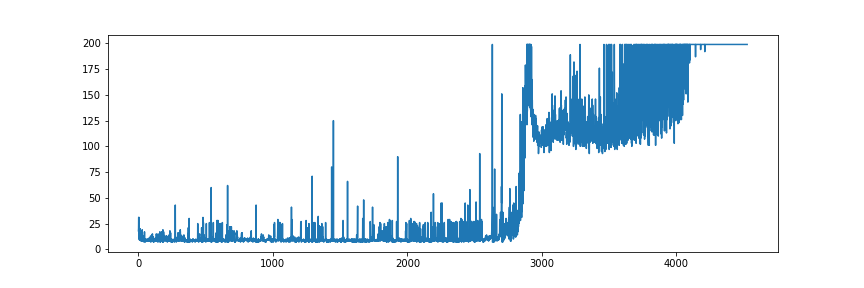
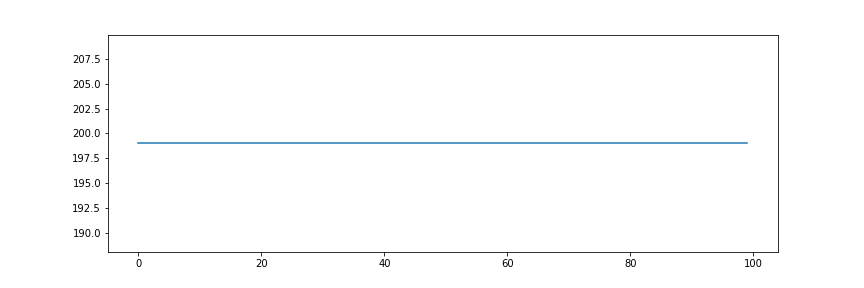

# DQN_CartPole

Implementation of DQN algorithm (Tensorflow 2.0)

Solve 'CartPole-v0' environment : the average score of 100 consecutive episodes is 195.0 or higher

training takes about 30 min

### training score plot

### test score plot

